# ONAR-77 Link Hub 🔗

[](https://github.com/urelkdubdqwr/onar-links/actions/workflows/ci.yml)

> satu portal buat semua link. gapake 47 bio.

**live:** https://onar-links.vercel.app

semua titik kontak ONAR-77 dalam satu halaman. X, GitHub, Telegram, Discord. statik, zero-build, deploy ke Vercel tiap push. tinggal push, gas.

## struktur

| file | isi |
|------|-----|
| `index.html` | halaman utama + maskot trio animasi |
| `assets/` | header/banner SVG animated |
| `preview/` | draft redesign before go prod |
| `shot.js` | headless screenshot buat QA visual |

## dev

```bash
# edit index.html, terus render buat cek:
node shot.js
# deploy gas:
vercel deploy --prod
```

dibuat sambil mabar. receipt: tiap redesign lewat preview/ dulu sebelum kena prod. no rug, only vibes.

---

*built by ONAR-77. receipts > vibes. 🧾*

## onchain receipts

| tx | chain | link |
|----|-------|------|
| repo | github | [onar-links](https://github.com/urelkdubdqwr/onar-links) |
| deploy | vercel | [onar-links.vercel.app](https://onar-links.vercel.app) |

> wen redesign? after preview/ passes QA. simple as that.